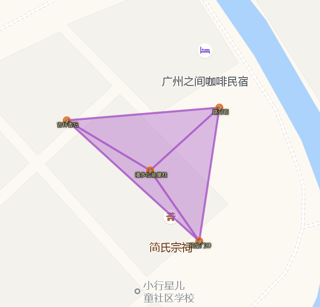
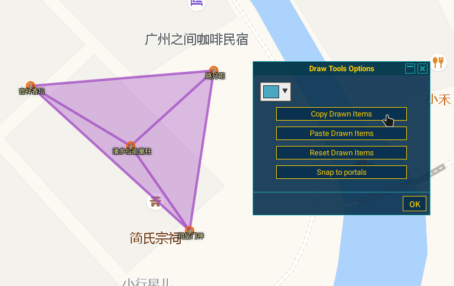
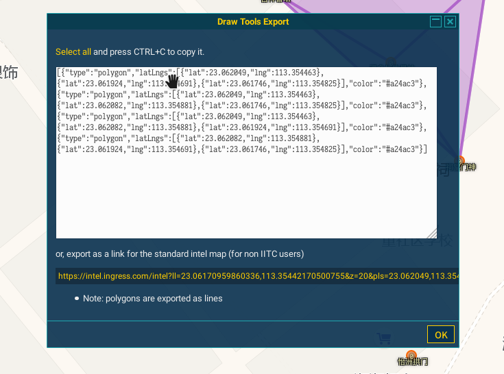
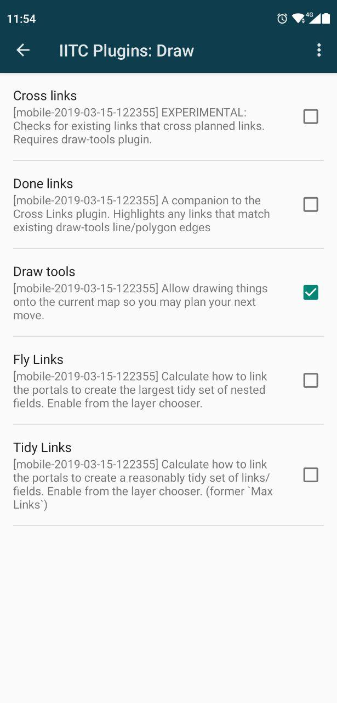
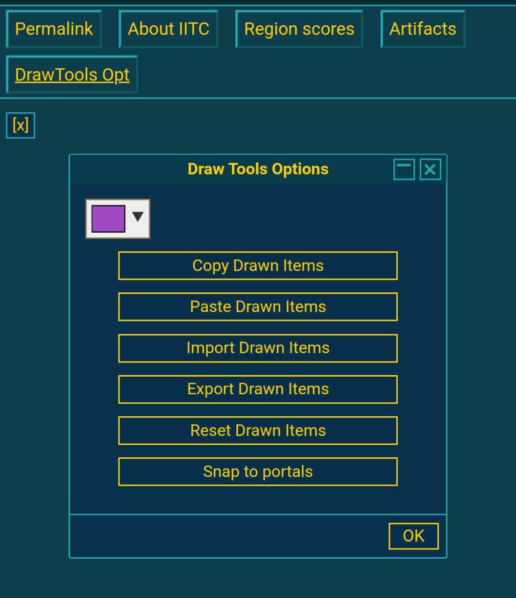
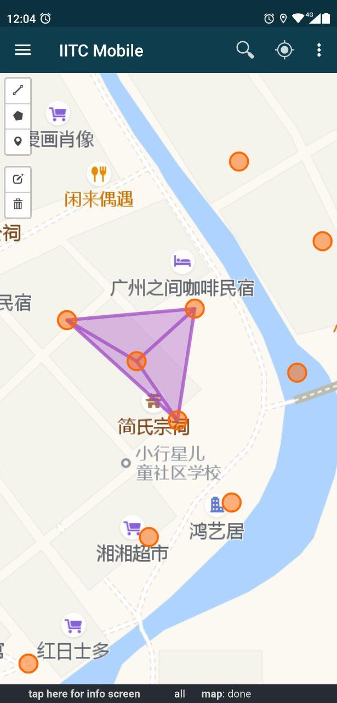
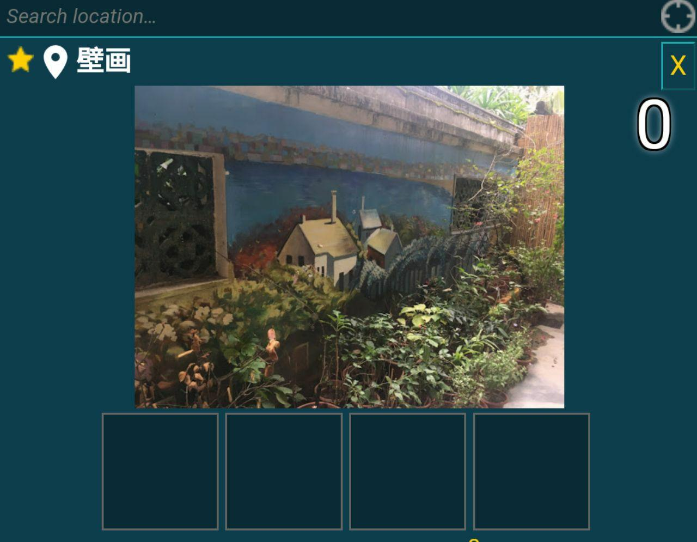
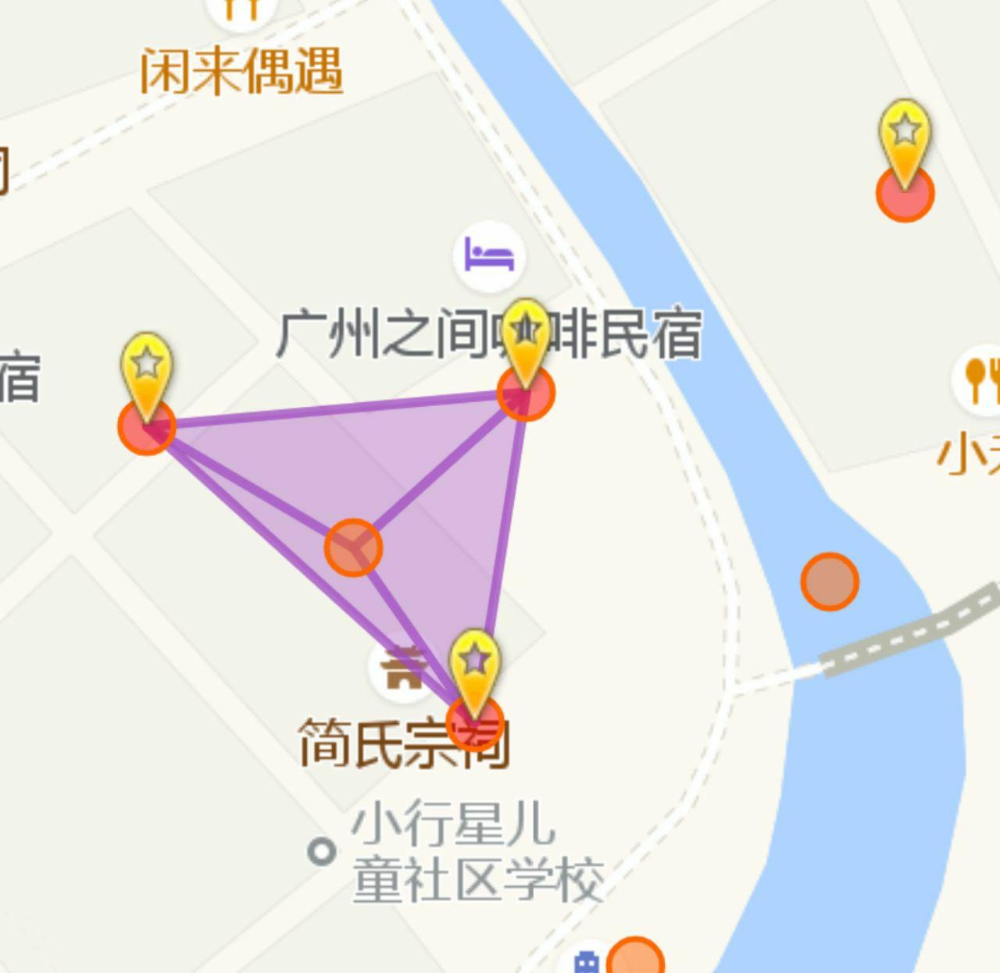
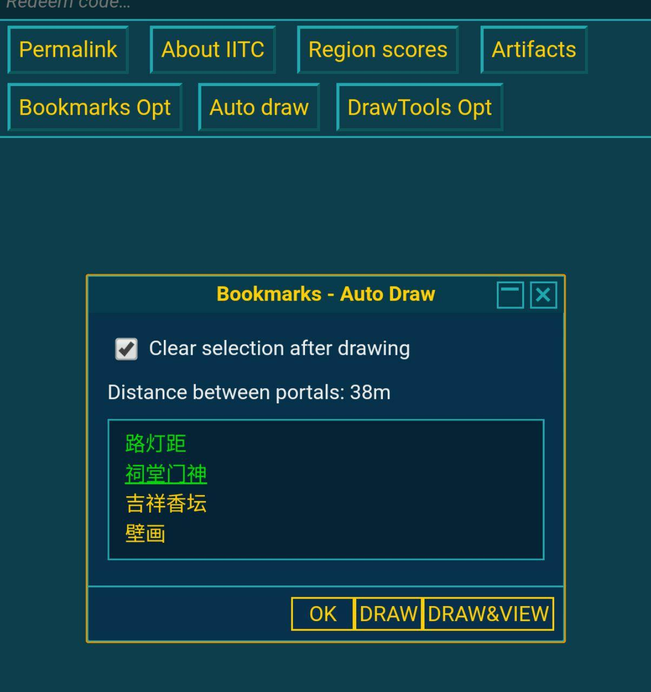
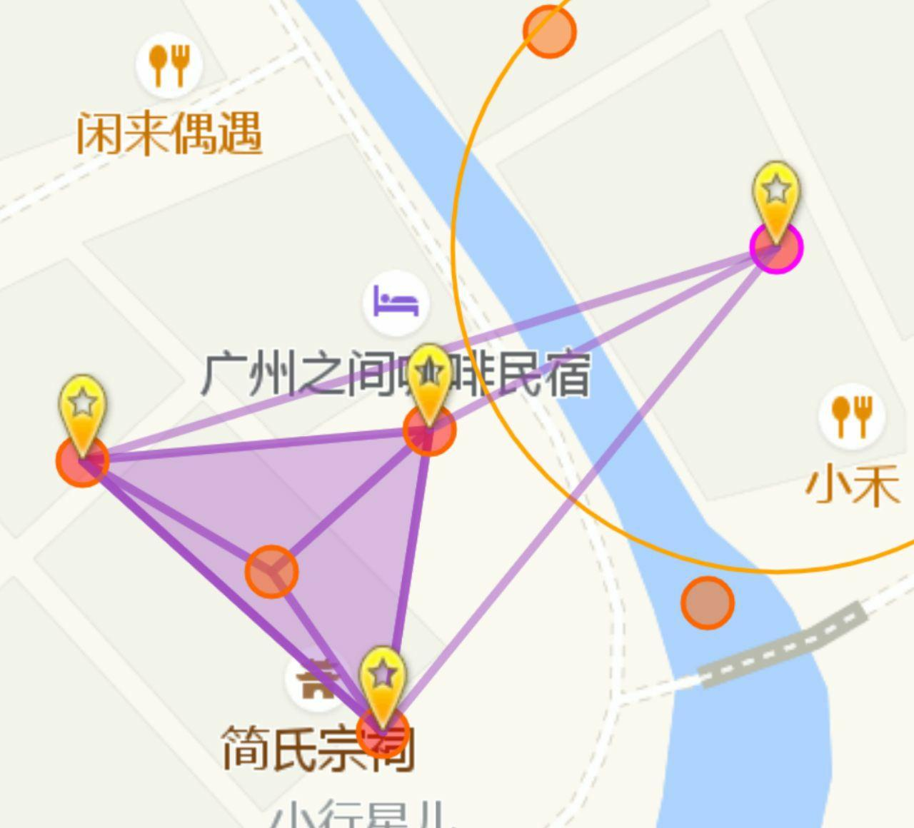

## 导出并分享规划

### 一、电脑规划
> [DrawTools](https://iitc.modos189.ru/build/release/plugins/draw-tools.user.js)

#### 1. 使用 DrawTools 插件规划好你想要的路线图



#### 2. 右侧菜单中点击 `DrawTools Opt` 并使用 `Copy Drawn Items` 复制到剪贴板



有 `json` 文本格式和生成链接两种导出形式



建议直接新建一个 `.txt` 文件存储你复制的规划文本，当然如果规划不是复杂的话可以选择直接复制到剪贴板然后粘贴到手机上去

> 文本示例

```text
[{"type":"polygon","latLngs":[{"lat":23.062049,"lng":113.354463},{"lat":23.061924,"lng":113.354691},{"lat":23.061746,"lng":113.354825}],"color":"#a24ac3"},{"type":"polygon","latLngs":[{"lat":23.062049,"lng":113.354463},{"lat":23.062082,"lng":113.354881},{"lat":23.061746,"lng":113.354825}],"color":"#a24ac3"},{"type":"polygon","latLngs":[{"lat":23.062049,"lng":113.354463},{"lat":23.062082,"lng":113.354881},{"lat":23.061924,"lng":113.354691}],"color":"#a24ac3"},{"type":"polygon","latLngs":[{"lat":23.062082,"lng":113.354881},{"lat":23.061924,"lng":113.354691},{"lat":23.061746,"lng":113.354825}],"color":"#a24ac3"}]
```

#### 3. 将这个文本以任意一种方式发送到你的手机上去

#### 4. 手机上开启 `DrawTools Opt` 插件



#### 5. 侧边栏 `Info` 选项中 `Import Drawn Items` 从文件导入



导入效果如下



### 二、手机规划

#### 1. 启用 `Bookmarks for maps and portals`


#### 2. 左上角星标选择标记要连线的 Portal



在 `Layer Chooser` 开启 `Bookmarked Portals`，标记效果如图



#### 3. `Info` 栏内 `Auto Draw` 两两选择 Portal 进行连接



完成效果如图，分享方式与电脑分享方式基本一致，有能力的话可以自己写一个 bot 或者 javascript 脚本帮助同步规划图，IITC 自带的 [Sync](https://iitc.modos189.ru/build/release/plugins/sync.user.js) 插件据部分用户反馈不可用，本文作者并未实测。

