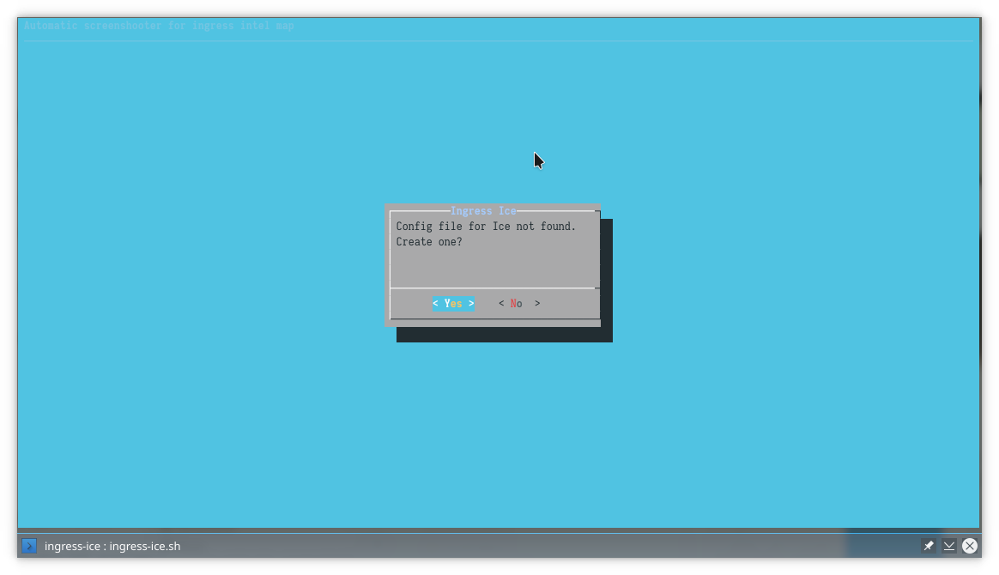
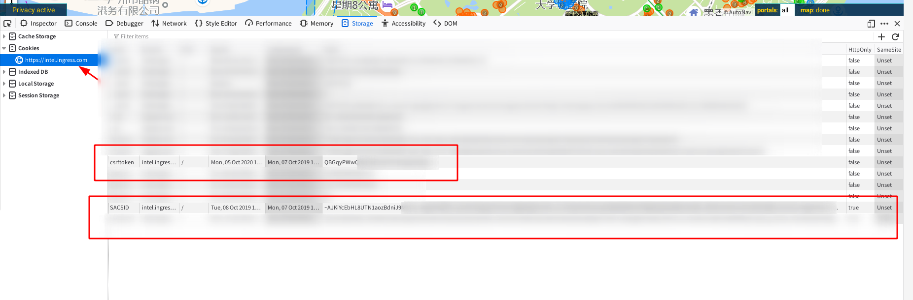
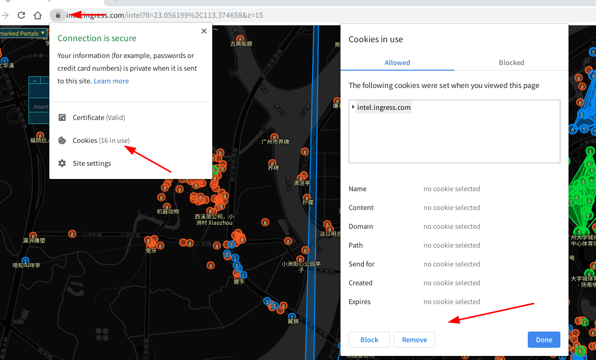

# ingress ICE 教程

[TOC]

## 简介

> Automatic screenshooter for ingress intel map.

> Intel 地图自动截图脚本：
[Ingress ICE](https://github.com/sndirsch/ingress-ice)


Ingress-ICE 是一个能够利用 PhantomJS“浏览器”加载 Intel 地图并实现区域定时截图的脚本，支持 Linux/MacOS/Windows 三种平台和 IITC 插件。

对于部分程序员来说 `PhantomJS` 并不陌生，它基于 KDE 在上世纪创立的浏览器内核鼻祖之一 `Webkit`（为 Safari 浏览器和 Chrome 系浏览器的前驱），常用于实现复杂网站爬虫的信息获取等。它没有用户界面，提供了一套 `JavaScript API` 方便从代码层面对网站页面进行操作。

- [WikiPedia: PhantomJS](https://en.wikipedia.org/wiki/PhantomJS)
- [WikiPedia: Webkit](https://en.wikipedia.org/wiki/Webkit)

## Linux 桌面用户

### 1. [PhantomJS 下载](https://phantomjs.org/download.html)

为了方便起见，可以直接从官方网站下载二进制包并解压。

### 2. [Ingress ICE 下载](https://github.com/sndirsch/ingress-ice.git)

可以直接从项目拉取：

```bash
$ git clone https://github.com/sndirsch/ingress-ice.git
```
或者从 Releases 下载源码包：

https://github.com/sndirsch/ingress-ice/archive/v4.5.6.tar.gz

### 3. 脚本使用

#### 3.1 准备

`ingress-ice.sh` 这个 `Shell Script` 在其中默认[（~~简单粗暴地~~）](https://github.com/sndirsch/ingress-ice/blob/9223d4f14de539ef3af1b11559e4d5d5382a9c85/ingress-ice.sh#L11)定义了 `SCRIPT_HOME` 作为 `PhantomJS` 二进制可执行文件的所在目录，且不会去寻找系统 `$PATH` 中的 `PhantomJS`。如有需要的话建议直接修改其脚本内容，并关闭 `忽略 SSL 安全错误` 的选项。无，则将下载到的压缩包解压到该项目文件目录即可。

```shell
$ whereis phantomjs

phantomjs: /home/axionl/.local/bin/phantomjs
```

**ingress-ice.sh patch**

```patch
From 750d63a1f3fa2864bfa1e60bf8c0d67fd5500f4d Mon Sep 17 00:00:00 2001
From: axionl <i@axionl.me>
Date: Tue, 8 Oct 2019 01:12:51 +0800
Subject: [PATCH 289/289] modify for linux user
---
ingress-ice.sh | 4 ++--
1 file changed, 2 insertions(+), 2 deletions(-)
diff --git a/ingress-ice.sh b/ingress-ice.sh
index 1071db2..28d700b 100755
--- a/ingress-ice.sh
+++ b/ingress-ice.sh
@@ -8,8 +8,8 @@ SCRIPT_HOME=$( cd "$( dirname "${BASH_SOURCE[0]}" )" && pwd )
COUNT=""
MACHINE_TYPE=`uname -m`
-PHANTOMJS="$SCRIPT_HOME/phantomjs"
-PHANTOMJS_FLAGS="--ignore-ssl-errors=true"
+PHANTOMJS="phantomjs"
+PHANTOMJS_FLAGS="--ignore-ssl-errors=false"
if (command -v dialog >/dev/null)
then
--
2.23.0
```

`PhantomJS` 本身支持以命令行参数的形式使用 `http 或者 socks5` 代理，但是由于脚本没有以 `Wrapper` 的形式实现，因此需要在脚本中的 `PHANTOMJS_FLAGS` 指定代理参数，或者图方便可以用 [ProxyChains](https://github.com/haad/proxychains) 直接在底层实现代理。

```bash
$ phantomjs --help | rg proxyd

--proxy=<val>                        Sets the proxy server, e.g. '--proxy=http://proxy.company.com:8080'
--proxy-auth=<val>                   Provides authentication information for the proxy, e.g. '-proxy-auth=username:password'
--proxy-type=<val>                   Specifies the proxy type, 'http' (default), 'none' (disable completely), or 'socks5'
```

#### 3.2 配置

确保脚本有可执行权限

```bash
$ chmod +x ingress-ice.sh
```

脚本提供了个简易的 TUI 进行初始化引导



如果你没有设置默认的 `$EDITOR` 环境变量的话脚本会使用 `Nano` 作为默认编辑器编辑配置文件，编辑后的配置文件会以隐藏文件的形式被保存在 `$HOME/.ingress-ice.conf`，可以使用 `ingress-ice.sh -r` 或者直接打开来编辑配置文件。


```ini
[ice]
# 需要查看的区域地图链接，例如：https://intel.ingress.com/intel?ll=23.056199%2C113.374658&z=15
area=
# 个人非常不建议在此使用以 Google 账户密码的方式进行登陆，建议使用现有 cookies 登陆，具体见后
#login=
#password=

[ice-optional]
# 每次截图延迟，以毫秒为单位
delay=300000
# Portals 详细程度
minlevel=1
maxlevel=8
# 截图大小，以像素为单位
width=1366
height=768
# 是否启用 IITC 插件，默认为原版 Intel 地图
iitc=false
# 插件配置，以选定地图为例
pluginsConfig=[{"key":"iitc-base-map","value":"Google Default Ingress Map"}]
# 第三方插件的链接和配置
plugins=["https://static.iitc.me/build/release/plugins/link-show-direction.user.js"]
pluginsConfig=[{"key":"plugin-linkshowdirection-mode","value":"Static near origin"},{"key":"iitc-base-map","value":"Google Roads"}]
# 是否在地图上标明时间戳和时区信息
timestamp=true
timezone=false
# 可选需要的隐藏信息
hideRes=false
hideEnl=false
hideLink=false
hideField=false
# 图片导出格式，jpg 或者 png
format=png
# 图片导出目录，默认为项目目录下的 screenshots 文件夹
directory=screenshots/
# 日志导出目录，如不需要请留空
consoleLog=

[cookies]
# Cookies 信息从浏览器上获得，具体方法见后
SACSID=
CSRF=

# 如果你有 Amazon S3 或者 Dropbox 网盘的话可以使用自动上传功能，此略
```

**从浏览器获取 Cookies 信息**

`Cookies` 相较与账户密码来说是一个属于用户的临时凭证，可以免去直接使用账户密码登陆的风险，如 `Cookies` 到期则需要修改配置文件进行更新。

- 对于 `Firefox` 浏览器
    正常登陆 `Intel` 之后，从开发者工具 `Storage Inspector`（或者按 `Shift + F9`）中获取 `Cookies`。

    
    
    将 `SACSID` 和 `csrftoken` 对应的 `Value` 填入 `ingress-ice.conf` 配置文件中。

- 对于 `Chromium 系`浏览器
    正常登陆 `Intel` 之后，从开发者工具（`F12` 打开） Application 中获取 `Cookies`。
    
    
    
    将 `SACSID` 和 `csrftoken` 对应的 `Value` 填入 `ingress-ice.conf` 配置文件中。

**如果获取不到 SACSID**，可以清除该网站在浏览器留下的 `Cookies` 信息并重新登陆获取，此处以 `Chromium` 浏览器为例，`Firefox` 同理。



#### 3.3 启动

可用的命令行参数如下，配置好代理即可执行命令。

```bash
$ ./ingress-ice.sh -h

Ingress ICE
Usage:
    ingress-ice.sh [-c 100] [-i settings.txt] [-r]
    ingress-ice.sh -h | -?
    ingress-ice.sh -a
Options:
    -h -?        Show this help 显示帮助
    -r           Edit your configuration 编辑配置文件
    -a           Show authors 显示作者
    -c <count>   Take <count> screenshots 设置所需截图
    -i <file>    Read settings from <file> or create config if not exists 读取指定配置文件
    -o           Delete old config and configure ice from scratch 删除配置文件
    -s           Run Ingress ICE in an endless loop (it will restart automatically after an error) 如果脚本执行过程中崩溃，自动重新开始

    Please visit https://ingress.netlify.com/ for more information
```

### 4. GIF 或视频制作

## Windows 用户

## MacOS 用户