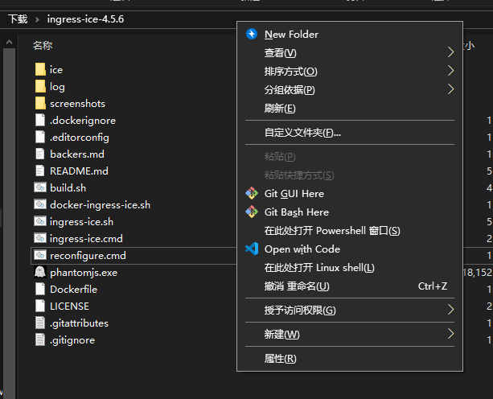

<!-- START doctoc generated TOC please keep comment here to allow auto update -->
<!-- DON'T EDIT THIS SECTION, INSTEAD RE-RUN doctoc TO UPDATE -->
**Table of Contents**  *generated with [DocToc](https://github.com/thlorenz/doctoc)*

- [ingress ICE 教程](#ingress-ice-%E6%95%99%E7%A8%8B)
  - [简介](#%E7%AE%80%E4%BB%8B)
  - [文件准备](#%E6%96%87%E4%BB%B6%E5%87%86%E5%A4%87)
    - [1. Ingress ICE](#1-ingress-ice)
    - [2. PhantomJS](#2-phantomjs)
  - [Linux 桌面用户](#linux-%E6%A1%8C%E9%9D%A2%E7%94%A8%E6%88%B7)
    - [1. 脚本使用](#1-%E8%84%9A%E6%9C%AC%E4%BD%BF%E7%94%A8)
      - [1.1 准备](#11-%E5%87%86%E5%A4%87)
      - [1.2 配置](#12-%E9%85%8D%E7%BD%AE)
      - [1.3 启动](#13-%E5%90%AF%E5%8A%A8)
    - [2. GIF 或视频制作](#2-gif-%E6%88%96%E8%A7%86%E9%A2%91%E5%88%B6%E4%BD%9C)
  - [Windows 用户](#windows-%E7%94%A8%E6%88%B7)
    - [1. 脚本使用](#1-%E8%84%9A%E6%9C%AC%E4%BD%BF%E7%94%A8-1)
      - [1.1 准备](#11-%E5%87%86%E5%A4%87-1)
      - [1.2 配置](#12-%E9%85%8D%E7%BD%AE-1)
      - [1.3 启动](#13-%E5%90%AF%E5%8A%A8-1)
    - [2. GIF 或视频制作](#2-gif-%E6%88%96%E8%A7%86%E9%A2%91%E5%88%B6%E4%BD%9C-1)
  - [MacOS 用户](#macos-%E7%94%A8%E6%88%B7)
  - [配置说明](#%E9%85%8D%E7%BD%AE%E8%AF%B4%E6%98%8E)
    - [从浏览器获取 Cookies 信息](#%E4%BB%8E%E6%B5%8F%E8%A7%88%E5%99%A8%E8%8E%B7%E5%8F%96-cookies-%E4%BF%A1%E6%81%AF)

<!-- END doctoc generated TOC please keep comment here to allow auto update -->

# ingress ICE 教程

[TOC]

## 简介

> matic screenshooter for ingress intel map.

> Intel 地图自动截图脚本：
[Ingress ICE](https://github.com/sndirsch/ingress-ice)


Ingress-ICE 是一个能够利用 PhantomJS“浏览器”加载 Intel 地图并实现区域定时截图的脚本，支持 Linux/MacOS/Windows 三种平台和 IITC 插件。

对于部分程序员来说 `PhantomJS` 并不陌生，它基于 KDE 在上世纪创立的浏览器内核鼻祖之一 `Webkit`（为 Safari 浏览器和 Chrome 系浏览器的前驱），常用于实现复杂网站爬虫的信息获取等。它没有用户界面，提供了一套 `JavaScript API` 方便从代码层面对网站页面进行操作。

- [WikiPedia: PhantomJS](https://en.wikipedia.org/wiki/PhantomJS)
- [WikiPedia: Webkit](https://en.wikipedia.org/wiki/Webkit)

## 配置说明

### 脚本的配置文件

```ini
[ice]
# 需要查看的区域地图链接，例如：https://intel.ingress.com/intel?ll=23.056199%2C113.374658&z=15
area=
# 个人非常不建议在此使用以 Google 账户密码的方式进行登陆，建议使用现有 cookies 登陆，具体见后
#login=
#password=

[ice-optional]
# 每次截图延迟，以毫秒为单位
delay=300000
# Portals 详细程度
minlevel=1
maxlevel=8
# 截图窗口大小，以像素为单位
width=1366
height=768
# 是否启用 IITC 插件，默认为原版 Intel 地图
iitc=false
plugins=["https://iitc.modos189.ru/build/release/total-conversion-build.user.js"]
# 插件配置，以选定地图为例
pluginsConfig=[{"key":"iitc-base-map","value":"Google Default Ingress Map"}]
# 第三方插件的链接和配置
plugins=["https://static.iitc.me/build/release/plugins/link-show-direction.user.js"]
pluginsConfig=[{"key":"plugin-linkshowdirection-mode","value":"Static near origin"},{"key":"iitc-base-map","value":"Google Roads"}]
# 是否在地图上标明时间戳和时区信息
timestamp=true
timezone=false
# 可选需要的隐藏信息
hideRes=false
hideEnl=false
hideLink=false
hideField=false
# 图片导出格式，jpg 或者 png
format=png
# 图片导出目录，默认为项目目录下的 screenshots 文件夹
directory=screenshots/
# 日志导出目录，如不需要请留空
consoleLog=

[cookies]
# Cookies 信息从浏览器上获得，具体方法见后
SACSID=
CSRF=

# 如果你有 Amazon S3 或者 Dropbox 网盘的话可以使用自动上传功能，此略
```

### 从浏览器获取 Cookies 信息

`Cookies` 相较与账户密码来说是一个属于用户的临时凭证，可以免去直接使用账户密码登陆的风险，如 `Cookies` 到期则需要修改配置文件进行更新。

- 对于 `Firefox` 浏览器
    正常登陆 `Intel` 之后，从开发者工具 `Storage Inspector`（或者按 `Shift + F9`）中获取 `Cookies`。

    
    
    将 `SACSID` 和 `csrftoken` 对应的 `Value` 填入 `ingress-ice.conf` 配置文件中。

- 对于 `Chromium 系`浏览器
    正常登陆 `Intel` 之后，从开发者工具（`F12` 打开） Application 中获取 `Cookies`。
    
    
    
    将 `SACSID` 和 `csrftoken` 对应的 `Value` 填入 `ingress-ice.conf` 配置文件中。

**如果获取不到 SACSID**，可以打开一个隐身模式的窗口新登录一次 Intel 来获取。

## 文件准备

### 1. Ingress ICE

直接从 Releases 下载源码包：

https://github.com/sndirsch/ingress-ice/archive/v4.5.6.tar.gz


熟悉 Git 的也可以去 [Ingress ICE 项目页面下载](https://github.com/sndirsch/ingress-ice.git)，或直接从项目拉取：

```bash
$ git clone https://github.com/sndirsch/ingress-ice.git
```

下载后随便解压到你方便的目录，得到 `ingress-ice-4.5.6` 文件夹。

### 2. PhantomJS

方便起见，直接从官方网站下载对应系统平台二进制包并解压。

[PhantomJS 下载](https://phantomjs.org/download.html)

也可以用各种包管理工具安装。

## Linux 桌面用户

### 1. 脚本使用

#### 1.1 准备

`ingress-ice.sh` 这个 `Shell Script` 在其中默认[（~~简单粗暴地~~）](https://github.com/sndirsch/ingress-ice/blob/9223d4f14de539ef3af1b11559e4d5d5382a9c85/ingress-ice.sh#L11)定义了 `SCRIPT_HOME` 作为 `PhantomJS` 二进制可执行文件的所在目录，且不会去寻找系统 `$PATH` 中的 `PhantomJS`。如有需要的话建议直接修改其脚本内容，并关闭 `忽略 SSL 安全错误` 的选项。无，则将下载到的压缩包解压到该项目文件目录即可。

```shell
$ whereis phantomjs

phantomjs: /home/axionl/.local/bin/phantomjs
```

**ingress-ice.sh patch**

```patch
From 750d63a1f3fa2864bfa1e60bf8c0d67fd5500f4d Mon Sep 17 00:00:00 2001
From: axionl <i@axionl.me>
Date: Tue, 8 Oct 2019 01:12:51 +0800
Subject: [PATCH 289/289] modify for linux user
---
ingress-ice.sh | 4 ++--
1 file changed, 2 insertions(+), 2 deletions(-)
diff --git a/ingress-ice.sh b/ingress-ice.sh
index 1071db2..28d700b 100755
--- a/ingress-ice.sh
+++ b/ingress-ice.sh
@@ -8,8 +8,8 @@ SCRIPT_HOME=$( cd "$( dirname "${BASH_SOURCE[0]}" )" && pwd )
COUNT=""
MACHINE_TYPE=`uname -m`
-PHANTOMJS="$SCRIPT_HOME/phantomjs"
-PHANTOMJS_FLAGS="--ignore-ssl-errors=true"
+PHANTOMJS="phantomjs"
+PHANTOMJS_FLAGS="--ignore-ssl-errors=false"
if (command -v dialog >/dev/null)
then
--
2.23.0
```

`PhantomJS` 本身支持以命令行参数的形式使用 `http 或者 socks5` 代理，但是由于脚本没有以 `Wrapper` 的形式实现，因此需要在脚本中的 `PHANTOMJS_FLAGS` 指定代理参数，或者图方便可以用 [ProxyChains](https://github.com/haad/proxychains) 直接在底层实现代理。

```bash
$ phantomjs --help | rg proxyd

--proxy=<val>                        Sets the proxy server, e.g. '--proxy=http://proxy.company.com:8080'
--proxy-auth=<val>                   Provides authentication information for the proxy, e.g. '-proxy-auth=username:password'
--proxy-type=<val>                   Specifies the proxy type, 'http' (default), 'none' (disable completely), or 'socks5'
```

#### 1.2 配置

确保脚本有可执行权限

```bash
$ chmod +x ingress-ice.sh
```

脚本提供了个简易的 TUI 进行初始化引导


如果你没有设置默认的 `$EDITOR` 环境变量的话脚本会使用 `Nano` 作为默认编辑器编辑配置文件，编辑后的配置文件会以隐藏文件的形式被保存在 `$HOME/.ingress-ice.conf`，可以使用 `ingress-ice.sh -r` 或者直接打开来编辑配置文件。

然后请参考本文最后一节的配置解释。

#### 1.3 启动

可用的命令行参数如下，配置好代理即可执行命令。

```bash
$ ./ingress-ice.sh -h

Ingress ICE
Usage:
    ingress-ice.sh [-c 100] [-i settings.txt] [-r]
    ingress-ice.sh -h | -?
    ingress-ice.sh -a
Options:
    -h -?        Show this help 显示帮助
    -r           Edit your configuration 编辑配置文件
    -a           Show authors 显示作者
    -c <count>   Take <count> screenshots 设置所需截图
    -i <file>    Read settings from <file> or create config if not exists 读取指定配置文件
    -o           Delete old config and configure ice from scratch 删除配置文件
    -s           Run Ingress ICE in an endless loop (it will restart matically after an error) 如果脚本执行过程中崩溃，自动重新开始

    Please visit https://ingress.netlify.com/ for more information
```

### 2. GIF 或视频制作

## Windows 用户

Windows 下的流程考虑到用户群体普遍未接触过命令行及复杂的配置，教程会尽量使用更多**预先约定好**的配置以降低使用难度。

### 1. 脚本使用

#### 1.1 准备

把[文件准备](#%e6%96%87%e4%bb%b6%e5%87%86%e5%a4%87)里提到下载的 `phantomjs-2.1.1-windows.zip` 解压，得到的文件中，将 `phantomjs-2.1.1-windows/bin/` 下的 `phantomjs.exe` 直接移动到准备好的 `ingress-ice-4.5.6` 文件夹下备用。

因为中国大陆无法直接访问 Ingress Intel，所以需要配置代理。配置方法是用文本编辑器打开 `ingress-ice.cmd` 修改这一行变成这样：

```cmd
phantomjs.exe --proxy=http://127.0.0.1:1080 --proxy-type=socks5 ice\ice.js %FILE% %COUNT%
```

到时就会调用 1080 端口的 socks5 代理。其中 `1080` 端口号请根据自己情况来修改。端口号通常可以在你正在使用的代理客户端设置找到。`socks5` 是现在比较常用的代理类型，其他类型请参考下面官方帮助修改。

```powershell
$ .\phantomjs.exe --help

--proxy=<val>                        Sets the proxy server, e.g. '--proxy=http://proxy.company.com:8080'
--proxy-auth=<val>                   Provides authentication information for the proxy, e.g. '-proxy-auth=username:password'
--proxy-type=<val>                   Specifies the proxy type, 'http' (default), 'none' (disable completely), or 'socks5'
```

#### 1.2 配置

第一次双击 `ingress-ice.cmd` 会弹出配置文件编辑界面。

当你参考开头的配置说明，配置完后，请保存并退出，程序会自动开始第一次截图。

配置文件默认会被保存在 `%APPDATA%\.ingress-ice.conf`，也即是 `C:\Users\你的用户名\AppData\Roaming`，后续可自行打开修改。


注意：建议不双击使用 `reconfigure.cmd`，它会直接重置你现有的配置。

#### 1.3 启动

打开文件浏览器，在 `ingress-ice.cmd` 所在目录下按住 Shift 键并在空白处右击，打开 Powershell。Windows 10 之前的系统可能是叫‘命令行窗口’。



输入命令 `.\ingress-ice.cmd -c 4` 即开始截图。

数字 `4` 为需要截图的张数。截图文件默认保存在 ICE 程序所在的下一级 `screenshots` 目录下。

更多使用命令请输入 `.\ingress-ice.cmd -h` 参考。

### 2. GIF 或视频制作

## MacOS 用户

### 1. 脚本使用

#### 1.1 基本命令行知识

- cd

```bash
# 进入下载目录，可输入文件夹开头字母，使用 Tab 补全
$ cd <路径名称>
```

- ls

```bash
# 查看所在目录下的文件，不加路径名称即为查看当前目录
$ ls <路径名称>
```

- chmod

```bash
# 进入下载目录后，为脚本添加可执行权限
$ chmod +x ingress-ice.sh
```

- sh

```bash
# 执行脚本文件，也可以在脚本拥有可执行权限后直接在目录下执行 ./ingress-ice.sh
$ sh -c ingress-ice.sh
```

#### 1.2 配置
将 `PhantomJS` 和 `ingress-ice` 下载并解压到同一个文件目录内

按开头的配置说明获取 cookies 并修改好脚本运行所需的配置文件

配置默认使用的是 `nano` 编辑器，下面列出一些基本快捷键：

- Ctrl + O 保存
- Ctrl + W 退出
- 方向键移动光标
- 右键复制粘贴，或者 Command + Shift + V

#### 1.3 启动

```bash
# 具体参数意义请见 Linux 启动部分，或者 -h 查看帮助
$./ingress-ice.sh -c <要截图的数量>
```

### 2. GIF 或视频制作